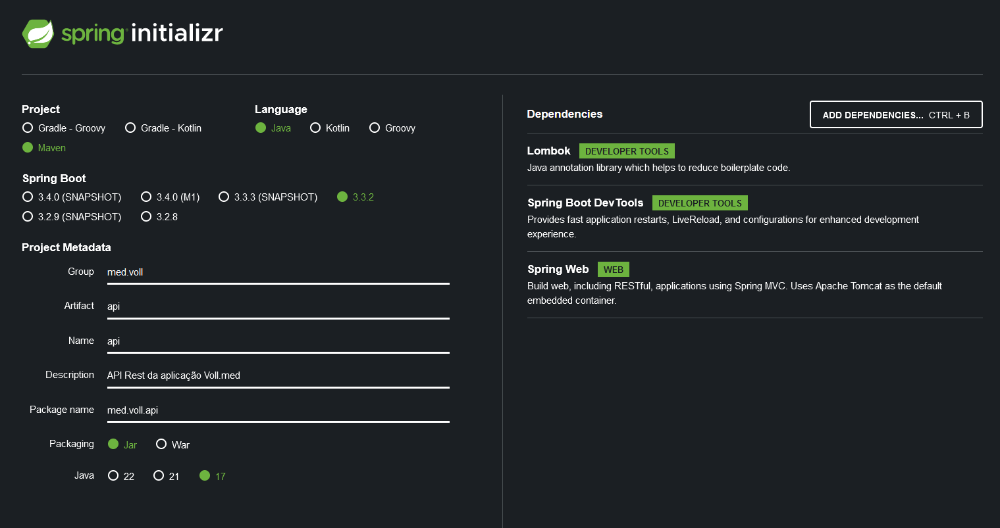

# springboot3-api-rest
Repositório utilizado na aula de Spring Boot 3 - Desenvolva uma API Rest


## Notas:
* Para configurar o projeto foi utilizado a seguinte ferramenta: https://start.spring.io/
  



* Para rodar o banco de dados MySQL use o comando:
```
docker compose up
```

* Para adicionar dependências no pom.xml posso utilizar o: https://start.spring.io/

* O PUT é para atualizações integrais em um recurso, o PATCH é para atualizações parciais. Há uma linha tênue que separa os dois, por isso, no curso, os instrutores optaram por utilizar o PUT.
